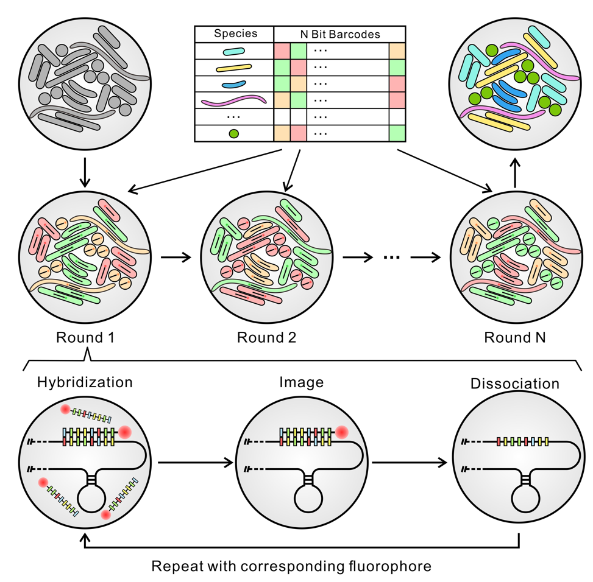
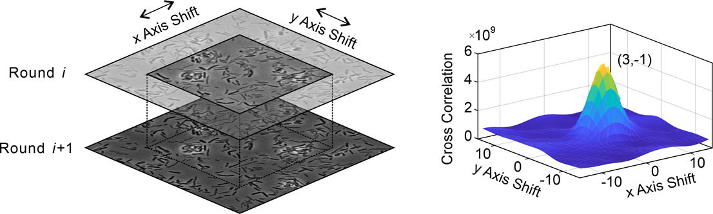
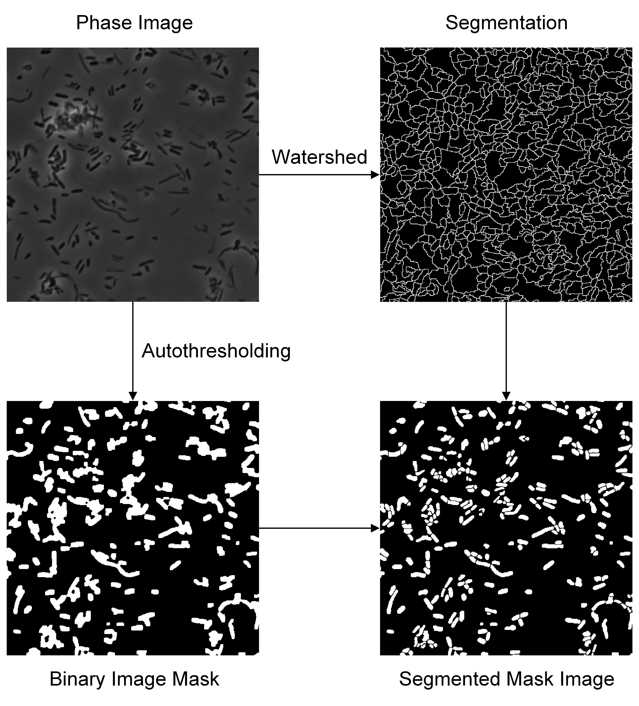
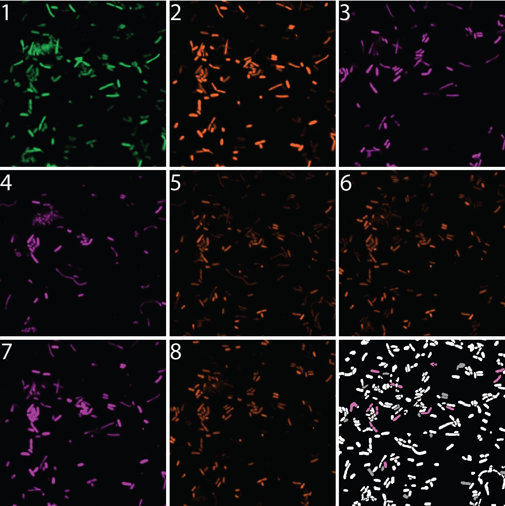
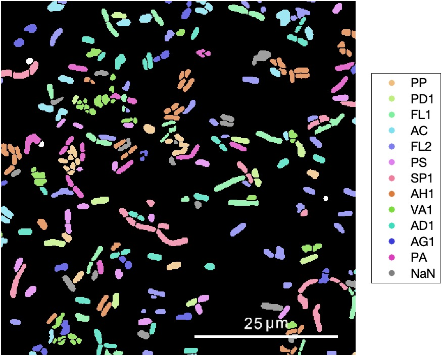

# Overview
In this Final Project, we present the image analysis method form SEER-FISH @Junyu has participated.


## Environment
- `MATLAB R2021b`
- `Image Processing Toolkit`
- `nd2reader` - [nd2reader](https://github.com/JacobZuo/nd2reader) for loading ```.nd2``` files captured by microscopy from Nikon.

## Image Analysis

### Image Alignment

Using the following commander to align multiple images in image stack ```Image```.

```matlab
[ImageAligned] = Alignment(Image)
```

The image stack will be aligned to the position with maximal cross correlation. The aligned image stack will be return as ```ImageAligned```.

To align other image stacks with the same position as ```Image```, you can use,
```matlab
[ImageAligned,Image2Aligned,Image3Aligned...] = Alignment(Image,Image2,Image3,..)
```

### Image Segment

To segment each bacterial cell in the image, you can use ```ImageSegment``` function. This function segment image based on auto threshold and watershed method. 

```matlab
[SegmentedBWImage] = ImageSegment(Image)
```




The ```Image``` input should be dark phase contrast image, i.e. bacteria cell is darker than the background. To segment fluorescent image, you can use the reversed image instead.

You can adjust the segmentation with Parameter as below. These parameters are defined in the table below.

```matlab
[SegmentedBWImage] = ImageSegment(Image, 'Parameter', value)
```

|      Parameters      	| Value                                                                                                                                    	|
|:--------------------:	|------------------------------------------------------------------------------------------------------------------------------------------	|
|     ```sePattern```     	| The pattern used in ```imerode``` and ```imdilate```. For example, ```strel('disk',1)```.                                                   	|
|     ```AreaRange```     	| The range of the area of the bacteria cells. The patterns with area out of range in the final segmented image will be dropped. For example ```[10,1000]```.                                                    	|
|     ```Threshold```     	| The threshold for generating the binary image. When ```Threshold``` is set as ```'Auto'```, the threshold will be generated according to the image. For example, ```'Auto'```, ```0.5```.                                                   	|
|     ```Effectiveness```     	| The effectiveness for auto threshold. If the auto threshold gives a effectiveness less than the given value, the image will be cut into several pieces to find a better threshold (See parameter ```N``` below). For example, ```0.65```.                                                   	|
|     ```N```     	| The image will be cut into ```N*N``` regions and the threshold for each region will be calculated. For example, ```10```.  

### Strain Identification

First, the color of each bacteria cell will be identified according to the fluorescent image stacks of each channel.

```matlab
[CodexRes] = ColorIdentify(SegmentedBWImage,FITCImage,TRITCImage,CY5Image,Index)
```

Then the obtained code will be identified according to the codebook and bits of correction.

```matlab
[StrainLikehood,Decode] = StrainIndentify(StrainCode,CodexRes,CorrBit)
```


### Demo

The ```Demo``` of image anaysis is given in ```Demo_ImageAnalysis.m```
### Result
final stacked image of 12 strains!



### Contribution
Mainly focus on:
- Image Alignment @Sijia
- Image Segmentation @Jingyi
- Strain Identification @Junyu
### Acknowledgement
Thanks to Dr. Wenlong Zuo for providing the raw data and adequate instruction.
Thanks to Zhaohui Cao and Prof. Lei Dai for introducing the new technology of sequential FISH.
Thanks to Prof. Fan Lam for introducing the knowledge of BIOE 504 that was used in the image analysis.
